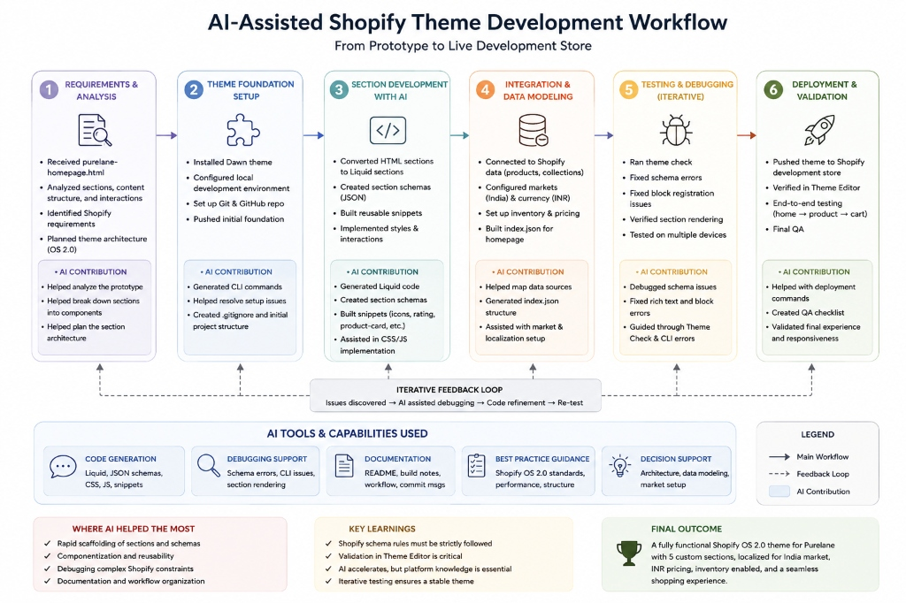

# AI Workflow & Build Notes

---

## AI Workflow

The workflow above shows how AI was used throughout the development process as an implementation and problem-solving accelerator, while Shopify-specific behavior, storefront rendering, market configuration, and final QA were manually validated.

### What I Delegated to AI

- **Prototype Breakdown**: Analyzing `purelane-homepage.html` to break down visual sections into modular Shopify OS 2.0 sections and reusable components.
- **Architecture Planning**: Planning JSON template architecture (`templates/index.json`), Liquid snippet extraction, and asset integration (`assets/purelane.css`, `assets/purelane.js`).
- **Liquid Scaffolding**: Generating initial section templates for Hero, Shop Grid, Combos Rail, Tiered Bundles, and Reviews Marquee.
- **Schema Construction**: Drafting section schemas, block limits, presets, and merchant settings.
- **Reusable Snippets**: Scaffolding `purelane-product-card.liquid`, `purelane-product-image.liquid`, `purelane-stars.liquid`, and `purelane-icons.liquid`.
- **CSS & Layout Assistance**: Consolidating prototype CSS design tokens (`--paper`, `--brand`, `--accent`, `--surface`), glassmorphism rules, responsive breakpoints, and keyframe animations.
- **Shopify Liquid & CLI Debugging**: Diagnosing Theme Check warnings, schema validation errors, and JSON template resolution constraints.
- **Theme Editor Troubleshooting**: Debugging section block registration rules and section lifecycle events (`shopify:section:load`, `shopify:section:unload`).
- **Markets & Currency Guidance**: Formatting price outputs (`variant.price | money_with_currency`) and market setup requirements for India (INR ₹).
- **Documentation Generation**: Drafting technical build notes, architectural breakdown, and README.

### Where AI Failed / Required Human Intervention

While AI accelerated code generation and structure planning, platform-specific constraints in Shopify required hands-on developer intervention and manual testing:

1. **Invalid Section Schema Defaults**: AI initially generated an `inline_richtext` setting for the Hero heading containing HTML tags (`Clean That Lasts`), which Shopify remote schema validation rejected (`Tag ' ' is not permitted`). *Human fix*: Replaced it with 3 compliant text settings (`heading_line_1`, `heading_line_2`, `heading_line_3`) and rendered `` in Liquid markup.
2. **Theme Editor Block Visibility**: AI generated empty string setting defaults (`"default": ""`) in block schemas, which caused Shopify's Theme Editor UI to suppress block management controls. *Human fix*: Cleaned block schema setting defaults and option labels to restore block addition and reordering in the Theme Editor.
3. **Hardcoded Fallback Values**: Initial AI scaffolding introduced hardcoded rating fallbacks (`4.8`, `237 reviews`). *Human fix*: Enforced strict data integrity by making rating rows conditional on real Shopify product metafields (`custom.rating`, `custom.review_count`), gracefully hiding unpopulated fields.
4. **Bundle Display Count Logic**: Initial AI block code permitted a contradiction between merchant `product_count` and actual `preview_products.size`. *Human fix*: Implemented Liquid priority logic so `preview_products.size` overrides `product_count` when preview products are assigned.
5. **JSON Template Section Settings**: Initial JSON template definitions omitted explicit section `"settings"` nodes, causing storefront template resolution failure (404 page). *Human fix*: Added explicit setting objects matching schema defaults across all section nodes in `templates/index.json`.
6. **Storefront & Markets Validation**: AI cannot execute browser interactions or verify real Shopify admin settings. Manual testing was performed to verify store location, India market activation, INR pricing displays, and responsive touch interactions across mobile and desktop viewports.

### What I Would Systematize for 20 Similar Builds

To scale this AI-assisted development model across 20+ theme builds, I would establish a standardized engineering pipeline:

1. **Prototype Analysis Checklist**: Standardized matrix to identify static components vs. dynamic Shopify objects before coding.
2. **Standard OS 2.0 Architecture Core**: Pre-built directory structure with base layout integration (`layout/theme.liquid`) and standard locales.
3. **Reusable Snippet Library**: Core library for SVG icons (`purelane-icons`), star ratings (`purelane-stars`), CDN images (`purelane-product-image`), and product cards (`purelane-product-card`).
4. **Standard Section Schema Templates**: Strict JSON schema templates adhering to Shopify's remote schema validation rules (no HTML in default strings, no empty string defaults).
5. **Standardized Product Card Component**: Unified card snippet supporting pinned footers, variant price derivation, compare-at badges, and sold-out states.
6. **Responsive CSS Design Token System**: Pre-defined CSS custom properties for colors, glassmorphism surfaces, typography scale, and responsive containers.
7. **Automated Theme Check Gate**: Running `shopify theme check` after every phase to catch syntax and schema offenses early.
8. **Storefront Smoke-Test Checklist**: Standardized manual test script covering homepage rendering, product detail navigation, cart form submissions, and Theme Editor block edits.
9. **Shopify Markets Checklist**: Standardized verification for market activation, currency formatting, and default store location.
10. **Standard QA Process**: Cross-viewport testing (375px, 768px, 1024px, 1440px), accessibility focus checks, and reduced-motion audits.
11. **Reusable AI Prompt Templates**: Battle-tested prompts tuned for Liquid OS 2.0 generation, schema creation, and CLI error diagnosis.
12. **Git Commit Checkpoints**: Enforcing atomic git commits at every phase completion for zero-regression rollbacks.

---

# Build Notes

## 1. What I Flagged About the Original Prototype

- **Visual Prototype vs. Production Architecture**: The supplied `purelane-homepage.html` was a static single-file prototype. It needed to be refactored into a modular Shopify OS 2.0 theme built on an official Shopify Dawn foundation.
- **Static Content to Dynamic Data Models**: All static product titles, prices, compare-at amounts, review scores, and images were replaced with native Shopify Liquid references (`product.title`, `variant.price`, `variant.compare_at_price`, `custom.rating`, `custom.review_count`).
- **Merchant Editability via Theme Editor**: Static layout structures were converted into section settings and block schemas (`purelane-hero`, `purelane-shop`, `purelane-combos`, `purelane-bundles`, `purelane-reviews`), allowing merchants to reorder, add, remove, and duplicate content dynamically.
- **Native Commerce Integration**: Product cards were equipped with native `<form method="post" action="/cart/add">` elements, variant ID inputs, and availability checks.
- **Responsive & Accessibility Requirements**: The prototype's CSS was refactored into `assets/purelane.css` to guarantee zero horizontal page overflow, high-contrast `:focus-visible` outlines, accessible screen reader text (`purelane-stars`), and reduced-motion fallbacks (`@media (prefers-reduced-motion: reduce)`).
- **India Market & Currency**: Visual prices were verified against India market settings with INR (`₹`) formatting.

## 2. What I Changed in the Code and Why

- **Shopify OS 2.0 Theme Integration**: Combined 5 custom Purelane Liquid sections with Dawn's official base files (`layout/theme.liquid`, `config/settings_schema.json`, `config/settings_data.json`, `locales/en.default.json`).
- **`layout/theme.liquid` Asset Loading**: Loaded `purelane.css` via `{{ 'purelane.css' | asset_url | stylesheet_tag }}` and `purelane.js` via `` to ensure global styling and script lifecycle events without duplicating asset tags.
- **`templates/index.json`**: Built a valid Shopify JSON template defining section order (`hero` → `shop` → `combos` → `bundles` → `reviews`) with explicit section settings objects matching schema defaults.
- **`sections/purelane-hero.liquid`**: Replaced static hero layout with a merchant-editable section supporting up to 3 value badges, 3 product slides, floating desktop badge rail, mobile badge strip, and auto-rotating product stage. Fixed heading schema to use 3 text settings (`heading_line_1`, `heading_line_2`, `heading_line_3`) preserving `` styling.
- **`sections/purelane-shop.liquid`**: Created a collection-driven product shelf rendering products dynamically through `snippets/purelane-product-card.liquid`.
- **`sections/purelane-combos.liquid`**: Built a pre-built combo rail accepting `product_list` inputs, automatically calculating combined variant prices and savings, with merchant price override support and hero highlight card styling (`.hero-combo`).
- **`sections/purelane-bundles.liquid`**: Implemented tiered bundle box cards with newline feature list parsing, preview image stacks, unit-price calculation notes, and product count priority (`preview_products.size` over `product_count`).
- **`sections/purelane-reviews.liquid`**: Built a continuous CSS marquee review section (`@keyframes marq`) with `aria-hidden="true"` duplicate pass handling for screen reader protection and reduced-motion scroll fallback.
- **`snippets/purelane-product-card.liquid`**: Extracted a reusable product card component with pinned footers, discount percentage calculation, variant selection inputs, and sold-out states.
- **`snippets/purelane-product-image.liquid`**: Created a responsive CDN image helper using `image_url` and `image_tag` with vector SVG bottle fallback (`.purelane-image-fallback`) when images are missing.
- **`snippets/purelane-stars.liquid`**: Created a star rating snippet rendering SVG stars and visually-hidden accessibility text.
- **`snippets/purelane-icons.liquid`**: Built a controlled SVG lookup snippet for sanitized icon options (`leaf`, `shield`, `sparkle`, `box`, `truck`).

## 3. Shopify Markets / India

- **Active Market**: India was configured as an active market in Shopify Admin.
- **Currency Configuration**: Indian Rupee (INR ₹) was set as the primary store currency and market currency.
- **Default Location**: Store default location was set to India for tax and shipping calculations.
- **Storefront Verification**: Verified storefront price displays (`₹499`, `₹799`, `₹349`) and collection rendering under the India market context.

## 4. What I Would Do With More Time

- **AJAX Cart Drawer Integration**: Connect cart forms directly to Dawn's AJAX cart drawer (`cart-drawer.liquid`) for instant slide-out cart feedback without page reloads.
- **Interactive Custom Box Builder**: Build a dynamic multi-step React/Liquid bundle app enabling customers to select individual products and build custom boxes in real-time.
- **Automated Visual Regression Test Suite**: Implement Playwright automated visual regression testing to capture screenshot diffs across viewports during CI/CD.
- **Advanced Predictive Search Customization**: Extend Dawn's predictive search drawer to highlight Purelane combos and bundle boxes directly in search results.
